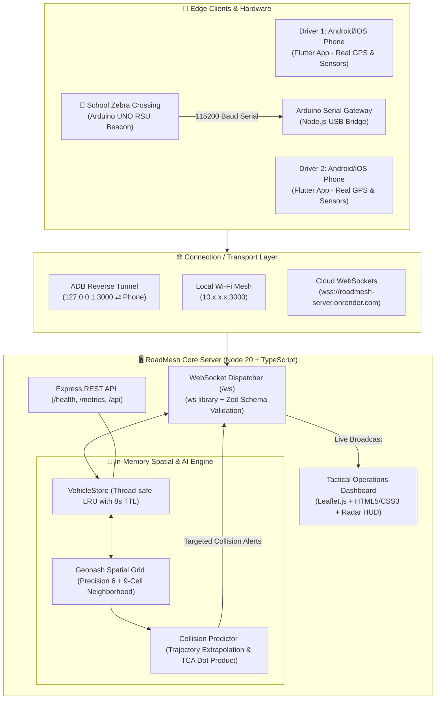
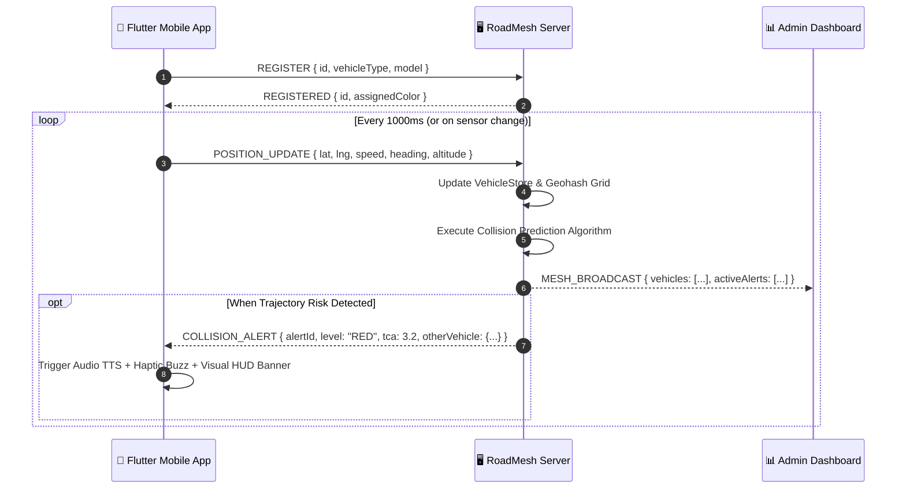
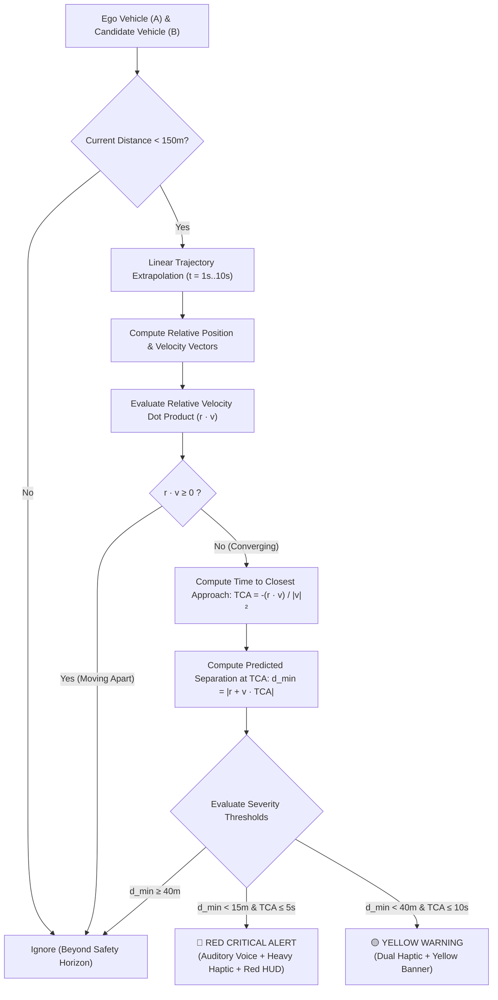
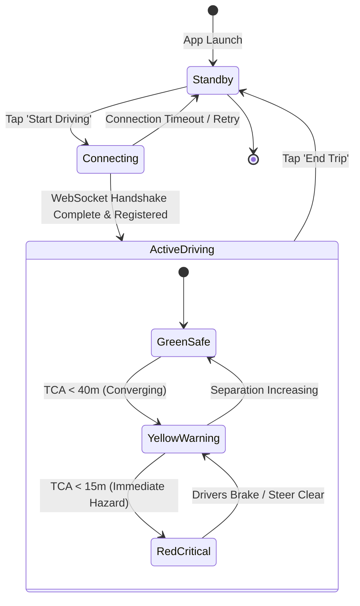

# 🚗 RoadMesh — Comprehensive System Architecture, Tech Stack & Connection Guide

> **Document Purpose**: This document provides an exhaustive, end-to-end architectural, algorithmic, and operational breakdown of **RoadMesh** from **A to Z**. It is designed to serve as a complete reference for engineers and LLMs to understand the system design, tech stack, data pipelines, network topology, mathematical models, and inter-component connections without ambiguity.

---

## 📑 Table of Contents
1. [Executive Summary & Core Philosophy](#1-executive-summary--core-philosophy)
2. [High-Level System Architecture & Topology](#2-high-level-system-architecture--topology)
3. [Subsystem Breakdown & Detailed Tech Stack](#3-subsystem-breakdown--detailed-tech-stack)
   - [3.1 Mobile Client Subsystem (`roadmesh-app`)](#31-mobile-client-subsystem-roadmesh-app)
   - [3.2 Backend Core & Spatial Engine (`roadmesh-server`)](#32-backend-core--spatial-engine-roadmesh-server)
   - [3.3 Tactical Operations Dashboard (`roadmesh-server/src/dashboard`)](#33-tactical-operations-dashboard-roadmesh-serversrcdashboard)
   - [3.4 V2I Roadside Unit Hardware & Gateway (`arduino`)](#34-v2i-roadside-unit-hardware--gateway-arduino)
   - [3.5 Orchestration & DevOps (`master.sh`, Docker, Nginx)](#35-orchestration--devops-mastersh-docker-nginx)
4. [How Components Connect & Communicate (End-to-End Data Flow)](#4-how-components-connect--communicate-end-to-end-data-flow)
   - [4.1 Network Connectivity Topologies](#41-network-connectivity-topologies)
   - [4.2 WebSocket Communication Protocols & Schemas](#42-websocket-communication-protocols--schemas)
   - [4.3 REST API Endpoints](#43-rest-api-endpoints)
5. [Algorithms & Mathematical Formulations](#5-algorithms--mathematical-formulations)
   - [5.1 Geohash Spatial Grid Indexing ($O(1)$ vs $O(N^2)$)](#51-geohash-spatial-grid-indexing-o1-vs-on2)
   - [5.2 Time-to-Closest-Approach (TCA) Collision Prediction](#52-time-to-closest-approach-tca-collision-prediction)
   - [5.3 Dead Reckoning & Telemetry Smoothing](#53-dead-reckoning--telemetry-smoothing)
6. [Lifecycle & State Management Workflow](#6-lifecycle--state-management-workflow)
7. [Directory Structure & File Manifest](#7-directory-structure--file-manifest)
8. [Quick-Start & Developer Cheat Sheet](#8-quick-start--developer-cheat-sheet)

---

## 1. Executive Summary & Core Philosophy

**RoadMesh** is a zero-hardware, 100% smartphone-based **Cooperative Vehicle Awareness & Collision Warning (V2X - Vehicle-to-Everything)** platform.

### The Problem
Traditional automotive V2X systems (such as DSRC or 3GPP C-V2X) require specialized onboard chips, aftermarket OBU/OBD dongles, and roadside units costing $600 to $2,000+ per vehicle. Consequently, adoption in dense, mixed-traffic developing economies (e.g., India) is nearly 0%.

### The RoadMesh Solution
RoadMesh democratizes vehicular safety by utilizing the sensors already present in every standard driver's smartphone:
1. **Sensors**: Multi-constellation GNSS/GPS, digital magnetometer compass, accelerometer, and gyroscope.
2. **Network**: Sub-millisecond full-duplex WebSockets over 4G/5G, Wi-Fi, or USB-tethered ADB reverse tunnels.
3. **Edge Spatial Intelligence**: A geohash spatial indexing core that groups vehicles into hierarchical geographic buckets, performing collision predictions up to 10 seconds ahead without computational bottlenecks.
4. **Multimodal Driver Feedback**: Sub-second alerts utilizing speech synthesis (TTS voice warnings), calibrated haptic vibration cadences, and glassmorphic heads-up display (HUD) visuals.
5. **V2I Infrastructure Extension**: Inexpensive microcontrollers (Arduino UNO) stationed at pedestrian crosswalks/schools that bridge directly into the mesh.

---

## 2. High-Level System Architecture & Topology



---

## 3. Subsystem Breakdown & Detailed Tech Stack

### 3.1 Mobile Client Subsystem (`roadmesh-app`)

The mobile application is a high-performance, real-time client providing navigation, telemetry broadcasting, tactical radar, and collision alerts.

* **Language**: Dart (SDK `>=3.0.0 <4.0.0`)
* **Framework**: Flutter 3.x (Multiplatform: Android, iOS, Web, macOS)
* **Rendering Engine**: Impeller (Vulkan / Metal)
* **Architecture Pattern**: Provider-based MVVM (Model-View-ViewModel) state management.

#### Key Packages & Responsibilities:
| Dependency | Version | Purpose in RoadMesh |
|---|---|---|
| `provider` | `^6.1.2` | Centralized reactive state management (`DrivingProvider`, `StatsProvider`). |
| `geolocator` | `^13.0.2` | Hardware GNSS/GPS tracking at `LocationAccuracy.high` with foreground service persistence. |
| `sensors_plus` | `^6.1.1` | Compass magnetometer heading, accelerometer, and orientation sensors. |
| `web_socket_channel` | `^3.0.2` | Low-latency binary/JSON streaming connection to `roadmesh-server`. |
| `google_maps_flutter` | `^2.10.0` | Production vector maps with custom night/day JSON styling, 3D tilt, and route polylines. |
| `flutter_map` & `latlong2` | `^8.3.2` | OpenStreetMap fallback engine with offline and tile caching support. |
| `flutter_tts` | `^4.2.0` | Text-to-Speech engine alerting drivers verbally (e.g. *"Caution: Vehicle approaching fast on left"*). |
| `vibration` | `^2.0.0` | Haptic feedback generating distinct pulse patterns (e.g., 500ms continuous for Red alerts, dual-staccato for Yellow). |
| `fl_chart` | `^0.69.0` | Interactive graphs in `StatsScreen` displaying speeds, telemetry latency, and risk history. |
| `battery_plus` | `^6.0.3` | Battery health tracking to dynamically throttle telemetry frequency in power-save mode. |
| `shared_preferences` | `^2.3.4` | Local key-value store persisting onboarding status, unit preferences, and vehicle profile. |
| `share_plus` | `^12.0.2` | Real-time geoposition sharing URL generation. |

#### Key Mobile Screens & Widgets:
* `driving_screen.dart`: The core HUD. Displays live Google Maps with customized route overlays, vehicle markers, dynamic speed gauge (`SpeedometerTopHud`), floating camera controls (`FloatingMapDock`), lane guidance overlay, and dynamic collision banners.
* `home_screen.dart`: Entry console with V2X radar pulse animation, network status, quick-start navigation, and vehicle type selection.
* `stats_screen.dart`: Post-drive safety diagnostics, average speeds, near-miss count, and time-in-risk distribution.
* `debug_screen.dart`: Technical diagnostic console for verifying WebSocket latency, GPS jitter, raw sensor vectors, and active geohash cells.

---

### 3.2 Backend Core & Spatial Engine (`roadmesh-server`)

The backend is a high-throughput, low-latency micro-engine written from scratch in TypeScript to run on Node.js or in Docker.

* **Language**: TypeScript 5.7.3 (`strict: true`)
* **Runtime**: Node.js `>=20.0.0`
* **Framework**: Express 4.21.2 (HTTP REST) + `ws` 8.18.0 (WebSockets)
* **Data Stores**: Pure In-Memory LRU Grid (Zero database bottleneck for real-time physics loops)
* **Validation**: `zod` 4.x runtime schema parsing
* **Test Suite**: Vitest 3.0.4 with Supertest integration tests

#### Key Modules:
1. `src/server.ts`: Initializes Express server, attaches WebSocket server (`ws.Server`), configures CORS, rate limiting, and serves the static Tactical Dashboard assets.
2. `src/protocol/websocket.ts`: Manages socket connections, heartbeat pings (every 30s), JSON message routing, and client disconnection cleanup.
3. `src/vehicles/store.ts`: In-memory thread-safe vehicle registry. Prunes stale nodes (TTL = 8,000ms) and updates position timestamps.
4. `src/spatial/geohash.ts` & `src/spatial/grid.ts`: Hierarchical geospatial bucket indexer utilizing `ngeohash`. Organizes all active vehicles into Level 6 geohash cells and queries the 9-cell Moore neighborhood.
5. `src/collision/predictor.ts`: Pure mathematical trajectory projection and relative velocity dot-product Time-of-Closest-Approach (TCA) engine.
6. `src/collision/alerts.ts`: Alert factory that creates deduplicated, severity-rated alert packets dispatched directly to targeted vehicles.

---

### 3.3 Tactical Operations Dashboard (`roadmesh-server/src/dashboard`)

A dark-mode, high-contrast operational console for traffic management centers, dispatchers, or project demonstration.

* **Tech Stack**: Vanilla HTML5, Modern CSS3 (Glassmorphism, custom CSS grid, pulse animations), Vanilla JavaScript (ES6+).
* **Mapping Engine**: Leaflet.js (`1.9.4`) with OpenStreetMap / CartoDB Dark Matter tile layer.
* **Connection**: Direct client WebSocket to `ws://<host>:<port>/ws`.
* **Features**:
  * Visualizes every active vehicle with heading-rotated icons and velocity vectors.
  * Draws real-time collision line corridors (Red dashed for critical, Yellow for warning).
  * Scenario Simulation Controls: Allows injecting artificial crossing vehicles, head-on collisions, and school zone events directly from buttons in the UI.
  * Live Telemetry Feed: Displays message throughput (packets/sec), active node count, and system memory.

---

### 3.4 V2I Roadside Unit Hardware & Gateway (`arduino`)

Extends vehicle safety to infrastructure (pedestrian zebra crossings, school gates, sharp mountain bends).

* **Microcontroller**: Arduino UNO (ATmega328P) running C++ firmware (`smart_crossing_beacon.ino`).
* **Pin Assignment**:
  * `Pin 2 (INPUT_PULLUP)`: Tactile crosswalk push-button for pedestrians.
  * `Pin 13 (OUTPUT)`: High-intensity roadside warning strobe LED.
  * `Serial (115200 baud)`: Bi-directional USB communication.
* **Edge Gateway (`arduino/gateway/gateway.js`)**:
  * Node.js daemon running on a host computer or Raspberry Pi connected to the Arduino via USB.
  * Automatically detects the serial port (`/dev/cu.usbmodem*` or `COMx`).
  * Translates serial button events into standardized RoadMesh `POSITION_UPDATE` JSON packets with `vehicleType: "PEDESTRIAN"`.
  * Features a fallback keyboard trigger: pressing `[SPACE]` or `[T]` in the terminal triggers the beacon event without physical hardware.

---

### 3.5 Orchestration & DevOps (`master.sh`, Docker, Nginx)

RoadMesh includes a complete, enterprise-grade orchestration suite:

* **Master Orchestration Script (`master.sh`)**:
  * 600-line Bash automation tool.
  * Verifies the toolchain (Node, npm, Flutter, ADB, Git).
  * Automatically identifies the connected physical Android device using ADB.
  * Executes `adb reverse tcp:3000 tcp:3000` to create a zero-latency USB bridge between phone and computer.
  * Automatically compiles, installs the APK, grants runtime location/notification permissions, and launches the app.
  * Spawns the server on port 3000 and opens the dashboard in the default browser.
* **Docker Setup (`docker-compose.yml`, `docker/Dockerfile`, `nginx.conf`)**:
  * Multi-stage build compiling TypeScript into production JavaScript.
  * Nginx reverse-proxy fronting the service with WebSocket proxying (`Upgrade` header handling).
* **Cloud Blueprints**:
  * `render.yaml`: Blueprint for one-click deployment to Render Web Services.

---

## 4. How Components Connect & Communicate (End-to-End Data Flow)

### 4.1 Network Connectivity Topologies

RoadMesh supports three distinct deployment and connection topologies:

#### Mode 1: USB Tethered / ADB Reverse Tunnel (Zero-Latency Local Dev)
Used during hardware testing and live demonstrations.
1. Android phone is connected via USB with USB Debugging enabled.
2. `master.sh` executes:
   ```bash
   adb reverse tcp:3000 tcp:3000
   ```
3. The Flutter app connects to `ws://127.0.0.1:3000/ws`. The Android OS forwards this port directly over the high-speed USB cable to the host computer's port 3000, achieving **0 ms router latency** and immunity to Wi-Fi drops.

#### Mode 2: Local Wi-Fi Mesh (Multi-Vehicle Field Testing)
Used when multiple smartphones are placed in real cars driving in proximity.
1. The host machine runs `roadmesh-server` bound to `0.0.0.0:3000`.
2. `master.sh` detects the local LAN IP (e.g. `10.39.66.50`).
3. Mobile clients connect to `ws://10.39.66.50:3000/ws` over the shared Wi-Fi router.

#### Mode 3: Cloud Edge Deployment (Public Internet Production)
1. `roadmesh-server` is deployed on a cloud provider (e.g. Render, AWS EC2).
2. Mobile clients connect via secure WebSockets: `wss://roadmesh-server.onrender.com/ws`.

---

### 4.2 WebSocket Communication Protocols & Schemas

All communication over `/ws` uses JSON messages conforming to the following structure:

```json
{
  "type": "MESSAGE_TYPE",
  "timestamp": 1788641105162,
  "payload": { ... }
}
```

#### Protocol Message Types:



#### 1. `REGISTER` (Client ➔ Server)
Sent immediately upon WebSocket connection:
```json
{
  "type": "REGISTER",
  "timestamp": 1725580800000,
  "payload": {
    "id": "veh-9f8e21a",
    "vehicleType": "CAR",
    "model": "Toyota Innova"
  }
}
```

#### 2. `POSITION_UPDATE` (Client ➔ Server)
Sent periodically (every 1,000ms or when significant movement occurs):
```json
{
  "type": "POSITION_UPDATE",
  "timestamp": 1725580801000,
  "payload": {
    "lat": 10.026154,
    "lng": 76.312588,
    "speed": 13.88,
    "heading": 85.4,
    "altitude": 12.0,
    "accuracy": 3.5,
    "vehicleType": "CAR"
  }
}
```
*(Note: Speed is in meters per second; heading is degrees clockwise from True North: $0^{\circ} = \text{North}, 90^{\circ} = \text{East}$)*.

#### 3. `COLLISION_ALERT` (Server ➔ Client)
Sent exclusively to the vehicles involved in a predicted collision:
```json
{
  "type": "COLLISION_ALERT",
  "timestamp": 1725580801050,
  "payload": {
    "alertId": "alt-4c12b",
    "level": "RED",
    "timeToCollision": 3.4,
    "predictedDistanceMeters": 6.8,
    "targetVehicle": {
      "id": "veh-b71c42",
      "lat": 10.026210,
      "lng": 76.312750,
      "speed": 15.2,
      "heading": 270.0,
      "vehicleType": "MOTORCYCLE"
    },
    "message": "Critical: Head-on conflict in 3.4s with Motorcycle"
  }
}
```

#### 4. `HAZARD_EVENT` (V2I / Client ➔ Server ➔ Broadcast)
Sent by Arduino Smart Crossing or manual reporting:
```json
{
  "type": "HAZARD_EVENT",
  "timestamp": 1725580802000,
  "payload": {
    "hazardId": "hz-school-01",
    "category": "PEDESTRIAN_CROSSING",
    "lat": 10.0261,
    "lng": 76.3125,
    "radiusMeters": 50.0,
    "active": true
  }
}
```

---

### 4.3 REST API Endpoints

While real-time traffic flows over WebSockets, the server exposes HTTP endpoints for health monitoring, metrics, and external integrations:

| Method | Endpoint | Description | Sample Output |
|---|---|---|---|
| `GET` | `/health` | Liveness and health check | `{"status":"ok","uptime":3600,"version":"1.0.0"}` |
| `GET` | `/metrics` | Prometheus-compatible operational statistics | Total messages, active nodes, alerts raised, memory |
| `GET` | `/api/vehicles` | Snapshot of all currently active nodes | `[{"id":"veh-1","lat":10.02,"lng":76.31,"speed":12}]` |
| `GET` | `/api/alerts` | List of active collision alerts currently enforced | Array of active `CollisionAlert` objects |
| `GET` | `/dashboard/` | Serves the web-based tactical radar console | HTML5/CSS3/JS Web application |

---

## 5. Algorithms & Mathematical Formulations

### 5.1 Geohash Spatial Grid Indexing ($O(1)$ vs $O(N^2)$)

#### The Problem:
Pairwise distance comparisons across $N$ vehicles require $\frac{N(N-1)}{2}$ operations ($O(N^2)$). For 1,000 vehicles, this is ~500,000 checks every second, which introduces latency and thermal throttling.

#### The RoadMesh Solution:
RoadMesh uses **Geohash Spatial Indexing** (Precision 6):
1. Precision 6 divides the world into bounding boxes approximately **$1.2\text{ km} \times 0.6\text{ km}$**.
2. When evaluating vehicle $V$, the engine determines its geohash string (e.g., `t0zg9w`).
3. To eliminate edge/boundary blind spots, the engine queries the **9-cell Moore Neighborhood** (the vehicle's cell plus all 8 adjacent cells):

```
┌──────────────┬──────────────┬──────────────┐
│  North-West  │    North     │  North-East  │
│  (t0zg9x)    │  (t0zg9z)    │  (t0zgbp)    │
├──────────────┼──────────────┼──────────────┤
│    West      │     EGO      │     East     │
│  (t0zg9t)    │  (t0zg9w)    │  (t0zgbn)    │
├──────────────┼──────────────┼──────────────┤
│  South-West  │    South     │  South-East  │
│  (t0zg9m)    │  (t0zg9q)    │  (t0zgbr)    │
└──────────────┴──────────────┴──────────────┘
```

4. Only vehicles inside these 9 cells are evaluated for collisions. This reduces lookup time to **$O(K)$ where $K \ll N$**, keeping spatial evaluation time under **1 millisecond**.

---

### 5.2 Time-to-Closest-Approach (TCA) Collision Prediction

The collision engine in `src/collision/predictor.ts` evaluates candidate pairs in two sequential phases:



#### Mathematical Formulation:

1. **Convert Geodetic Coordinates to Local Cartesian Plane**:
   Given two positions $P_1 = (\text{lat}_1, \text{lng}_1)$ and $P_2 = (\text{lat}_2, \text{lng}_2)$:
   $$x = R \cdot \Delta \text{lng} \cdot \cos\left(\frac{\text{lat}_1 + \text{lat}_2}{2}\right)$$
   $$y = R \cdot \Delta \text{lat}$$
   *(where $R = 6,371,000\text{ m}$ is Earth's mean radius)*.

2. **Velocity Vector Conversion**:
   Given speed $s$ (m/s) and heading $\theta$ (degrees from North):
   $$v_x = s \cdot \sin(\theta)$$
   $$v_y = s \cdot \cos(\theta)$$

3. **Relative Position and Velocity**:
   $$\vec{r} = \begin{bmatrix} x_2 - x_1 \\ y_2 - y_1 \end{bmatrix}, \quad \vec{v} = \begin{bmatrix} v_{x2} - v_{x1} \\ v_{y2} - v_{y1} \end{bmatrix}$$

4. **Time of Closest Approach (TCA)**:
   The distance squared as a function of future time $t$ is:
   $$D^2(t) = \|\vec{r} + \vec{v}t\|^2 = \|\vec{r}\|^2 + 2(\vec{r} \cdot \vec{v})t + \|\vec{v}\|^2 t^2$$
   Setting the derivative $\frac{d}{dt}D^2(t) = 0$ yields:
   $$\text{TCA} = -\frac{\vec{r} \cdot \vec{v}}{\|\vec{v}\|^2}$$

5. **Distance at Closest Approach**:
   $$d_{\text{min}} = \|\vec{r} + \vec{v} \cdot \text{TCA}\|$$

---

### 5.3 Dead Reckoning & Telemetry Smoothing

Smartphones experience GPS latency and jitter (typically 1Hz to 5Hz updates). To maintain smooth 60fps animations on the client and avoid false collision spikes on the server:

* **Client-side Dead Reckoning**: When rendering vehicles on Google Maps, `VehicleMarkerPainter` interpolates between the last reported GPS position and the dead-reckoned position:
  $$P_{\text{display}}(t) = P_{\text{last}} + \vec{v} \cdot \Delta t$$
* **Jitter Filter**: Discards GPS readings with accuracy $> 20\text{ m}$ or unrealistic vehicle acceleration ($> 10\text{ m/s}^2$).

---

## 6. Lifecycle & State Management Workflow



---

## 7. Directory Structure & File Manifest

```
Ctrl+Cre8/
├── README.md                          # Project overview & quick-start guide
├── master.sh                          # 🚀 Master orchestrator script (All-in-one runner)
├── run.sh                             # Alternate multi-platform runner script
├── docker-compose.yml                 # Docker compose specification
├── nginx.conf                         # Reverse proxy config for containerized stack
├── render.yaml                        # Blueprint for 1-click cloud deploy on Render
│
├── docs/                              # Formal architectural & API documentation
│   ├── API_REFERENCE.md               # WebSocket & REST API schema definitions
│   ├── ARCHITECTURE.md                # Spatial geohashing & collision mathematics
│   ├── CLOUD_DEPLOYMENT.md            # Render & Vercel production deployment guide
│   └── DEPLOYMENT.md                  # Local & container setup guide
│
├── arduino/                           # Hardware V2I Roadside Unit (RSU) subsystem
│   ├── smart_crossing_beacon/
│   │   └── smart_crossing_beacon.ino  # Arduino UNO C++ firmware (pedestrian button + strobe)
│   └── gateway/
│       ├── gateway.js                 # Node.js Serial-to-WebSocket bridge
│       └── package.json               # Gateway dependencies (ws, serialport)
│
├── roadmesh-server/                   # Backend core, spatial engine & web dashboard
│   ├── package.json                   # Server dependencies (Express, ws, ngeohash, zod, vitest)
│   ├── tsconfig.json                  # TypeScript compiler settings
│   ├── src/
│   │   ├── index.ts                   # Entry point: starts HTTP & WebSocket listeners
│   │   ├── server.ts                  # Express application setup, routes, static file serving
│   │   ├── protocol/
│   │   │   └── websocket.ts           # WebSocket connection manager, heartbeat & routing
│   │   ├── vehicles/
│   │   │   ├── store.ts               # In-memory thread-safe vehicle store with TTL expiry
│   │   │   └── types.ts               # TypeScript types for vehicle telemetry & states
│   │   ├── spatial/
│   │   │   ├── geohash.ts             # Precision 6 Geohash conversion utilities
│   │   │   └── grid.ts                # 9-cell Moore neighborhood spatial grid index
│   │   ├── collision/
│   │   │   ├── predictor.ts           # TCA & trajectory projection mathematics
│   │   │   └── alerts.ts              # Alert classification, deduplication & factories
│   │   └── dashboard/                 # Tactical Operations Web Console
│   │       ├── index.html             # Dashboard UI structure & controls
│   │       ├── dashboard.css          # Glassmorphism theme, radar animation, tactical HUD
│   │       └── dashboard.js           # Leaflet map, live WebSocket listener, scenario injectors
│   └── tests/
│       ├── unit/                      # Vitest unit tests for TCA, geohash & vehicle store
│       └── integration/               # Full-cycle WebSocket message tests
│
└── roadmesh-app/                      # 📱 Flutter cross-platform mobile application
    ├── pubspec.yaml                   # Flutter dependencies (geolocator, google_maps, provider)
    ├── android/                       # Native Android harness (Manifest, permissions, Gradle)
    ├── ios/                           # Native iOS harness (Info.plist location privacy keys)
    ├── assets/                        # Custom audio, icons, and fonts (Orbitron, Inter)
    └── lib/
        ├── main.dart                  # Flutter entry point, theme declaration, routes
        ├── config/
        │   └── constants.dart         # Server URLs, port, safety distances, map zoom defaults
        ├── models/
        │   ├── alert.dart             # Collision alert data model & severity enums
        │   └── vehicle.dart           # Vehicle telemetry model & coordinate parsing
        ├── providers/
        │   ├── driving_provider.dart  # Primary navigation, WebSocket, risk state engine
        │   └── stats_provider.dart    # Historical drive metrics & risk exposure recorder
        ├── navigation/
        │   ├── route_service.dart     # Google Directions API routing & turn-by-turn maneuvers
        │   └── navigation_route.dart  # Navigation step & waypoint models
        ├── services/
        │   ├── websocket_service.dart # WebSocket connection, queueing & auto-reconnect backoff
        │   ├── location_service.dart  # GNSS stream wrapper with accuracy filtering
        │   ├── collision_service.dart # Client-side alert handler, TTS audio & vibration triggers
        │   ├── battery_service.dart   # Battery drain optimization
        │   └── app_logger.dart        # Structured console logging
        ├── screens/
        │   ├── home_screen.dart       # Main launch console with animated radar scanner
        │   ├── driving_screen.dart    # Tactical driving HUD with Google Maps, alerts & telemetry
        │   ├── stats_screen.dart      # Drive summary graphs & telemetry analysis
        │   ├── debug_screen.dart      # Real-time raw sensor inspection & latency tester
        │   └── onboarding_screen.dart # First-time permissions & vehicle configuration wizard
        └── widgets/
            ├── speedometer_top_hud.dart       # High-contrast speedometer & speed limit sign
            ├── floating_map_dock.dart         # Right vertical controls (Zoom, Theme, 3D, Compass)
            ├── nav_floating_pill_bar.dart     # Bottom capsule showing ETA, distance & maneuvers
            ├── geoposition_share_banner.dart  # Real-time location sharing drawer
            └── vehicle_marker_painter.dart    # Custom Canvas painter for dynamic vehicle arrows
```

---

## 8. Quick-Start & Developer Cheat Sheet

### Common Development Tasks:

#### 1. Launch Full Stack (Server + Android Device + Web Dashboard)
```bash
./master.sh --all
```

#### 2. Launch Backend Dev Server Only
```bash
cd roadmesh-server
npm install
npm run dev
# Dashboard at: http://localhost:3000/dashboard/
# WebSocket at: ws://localhost:3000/ws
```

#### 3. Run Automated Tests
```bash
cd roadmesh-server
npm test
```

#### 4. Run Mobile App on Physical Phone
Ensure USB Debugging is turned on:
```bash
# Set up reverse tunnel so phone reaches laptop server over USB:
adb reverse tcp:3000 tcp:3000

cd roadmesh-app
flutter pub get
flutter run
```

#### 5. Run Arduino Hardware Gateway
```bash
cd arduino/gateway
npm install
node gateway.js
```

---

## 9. Summary for Downstream LLMs & Automated Agents

When extending, refactoring, or querying this codebase, keep these core architectural invariants in mind:

1. **State Ownership**: `DrivingProvider` on the mobile client owns all navigation and telemetry states. `VehicleStore` on the server is the single source of truth for global spatial data.
2. **Coordinate Standard**: All internal calculations use Decimal Degrees (WGS84) for positions, meters per second for speeds, and degrees ($0^{\circ}\text{--}360^{\circ}$ clockwise from True North) for headings.
3. **No Database on Critical Path**: The collision prediction pipeline operates completely in-memory using Geohash grids. Do not introduce database queries (e.g. MongoDB/PostgreSQL) inside the `POSITION_UPDATE` execution loop.
4. **Latency Budget**: The system target is sub-100ms from mobile GPS sensor read to alert presentation on conflicting vehicles. Keep WebSocket payloads compact and unpadded.
