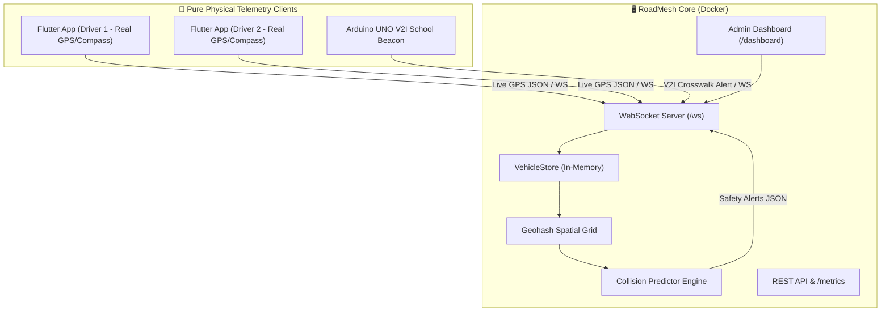

# 🚗 RoadMesh — 100% Smartphone-Based Cooperative Vehicle Awareness & V2X Platform

[](https://github.com/mizhabas/major-project/actions/workflows/server-ci.yml)
[](https://github.com/mizhabas/major-project/actions/workflows/flutter-ci.yml)
[](LICENSE)
[](https://flutter.dev)
[](https://nodejs.org)

**RoadMesh** is a real-time, **zero-hardware, 100% smartphone-based** Cooperative Vehicle Awareness and Collision Warning Platform designed specifically for high-density, mixed-traffic environments like Indian roads. Vehicles broadcast live smartphone telemetry over ultra-low-latency WebSockets, and the spatial AI prediction engine computes potential collision risks up to 10 seconds ahead—alerting drivers via real-time voice, haptics, and visual HUD warnings.

> **💡 Zero-Hardware V2X Paradigm**: Traditional V2X relies on expensive automotive DSRC/5G chips ($600+ / ₹50,000+). RoadMesh democratizes V2X safety by turning any regular Android/iOS smartphone into an intelligent connected vehicle node with zero extra hardware.

---

## 🌟 Key Features

- **📱 Pure Smartphone V2X (Zero Hardware)**: No aftermarket dongles, OBD units, or microcontrollers needed. Runs directly on drivers' existing smartphones.
- **⚡ Sub-Second Latency Telemetry**: Ultra-lightweight JSON telemetry payloads transmitted over high-speed WebSockets.
- **🧠 Geohash Spatial Indexing**: Precision 6 geohash grid lookup evaluating 9 neighboring cells for sub-millisecond nearby vehicle lookup without $O(N^2)$ bottlenecks.
- **🎯 Predictive Collision AI**: Trajectory projection and relative velocity dot-product Time-of-Closest-Approach (TCA) calculation up to 10 seconds ahead.
- **🎨 Glassmorphic HUD App**: Modern Flutter dark UI with Orbitron font, glassmorphic cards, animated radar, and custom particle background.
- **📊 Real-Time Admin Web Dashboard**: Interactive Leaflet.js map tracking all active vehicles, speeds, headings, and collision alerts.
- **🚸 Arduino V2I Smart Crossing**: Hardware Roadside Unit (RSU) integration for school zones and vulnerable road users.
- **🐳 One-Command Docker Setup**: Fully containerized stack with Nginx reverse proxy.
- **🧪 Comprehensive Test Suite**: Fully automated unit and integration tests passing.

---

## 🏗️ System Architecture



---

## ⚡ Master Orchestration (One-Click Run Everything)

Run the full RoadMesh platform (Core Server, Tactical Map Dashboard, and connected Android phone via ADB reverse tunnel) with a single command:

```bash
./master.sh --all
```

Or start the interactive CLI menu:
```bash
./master.sh
```

| Flag | Purpose |
|---|---|
| `./master.sh --all` | Starts server, configures USB tunnel, installs/launches app on phone, opens dashboard |
| `./master.sh --server` | Starts backend on port 3000 & opens browser dashboard |
| `./master.sh --mobile` | Connects phone, sets up reverse tunnel, installs app & grants GPS permissions |
| `./master.sh --cloud <url>` | Compiles & deploys mobile app targeted to live Render cloud server |
| `./master.sh --status` | Live diagnostic of server, connected phone, tunnels, and active nodes |
| `./master.sh --stop` | Stops all background services |

---

## 🐳 Quick Start (Docker)

Run the containerized stack (Server + Admin Dashboard + Nginx Proxy):

```bash
docker-compose up -d --build
```

- **Admin Web Dashboard**: [`http://localhost/dashboard`](http://localhost/dashboard)
- **WebSocket Endpoint**: `ws://localhost/ws`

---

## ☁️ Cloud & Live Product Deployment (Render & Vercel)

- **Render Web Service**: One-click deployment via blueprint [`render.yaml`](render.yaml) for backend WebSockets and spatial AI.
- **Vercel Edge CDN**: Instant dashboard deployment via [`vercel.json`](vercel.json).
- Detailed guide: [docs/CLOUD_DEPLOYMENT.md](docs/CLOUD_DEPLOYMENT.md).

---

## 💻 Manual Component Setup

### 1. Backend Server (`roadmesh-server`)
```bash
cd roadmesh-server
npm install
npm test          # Run automated unit & integration tests
npm run dev       # Start dev server on http://localhost:3000
```

### 2. Flutter Mobile App (`roadmesh-app`)
```bash
cd roadmesh-app
flutter pub get
flutter run       # Launch on connected emulator/device
```

---

## 📚 Documentation Index

- 📖 [API & Protocol Reference](docs/API_REFERENCE.md) — WebSocket message formats & REST endpoints.
- 🐳 [Deployment Guide](docs/DEPLOYMENT.md) — Docker Compose details & environment variables.
- 📐 [Architecture Reference](docs/ARCHITECTURE.md) — Geohashing spatial grid and TCA collision calculation algorithms.

---

## 📄 License

Distributed under the MIT License. See `LICENSE` for more information.
