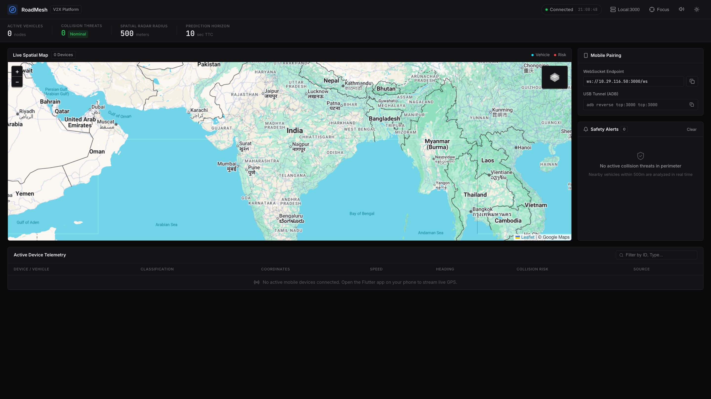
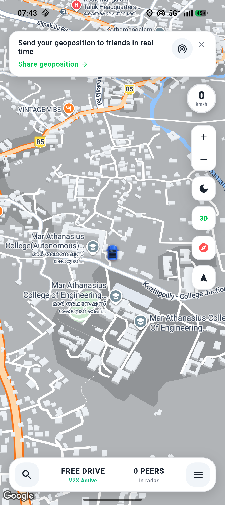
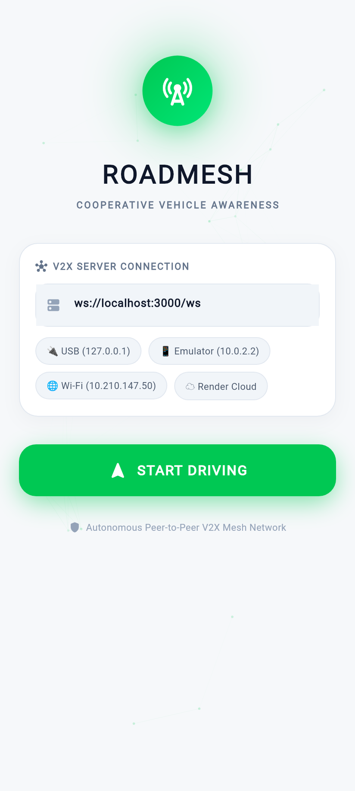
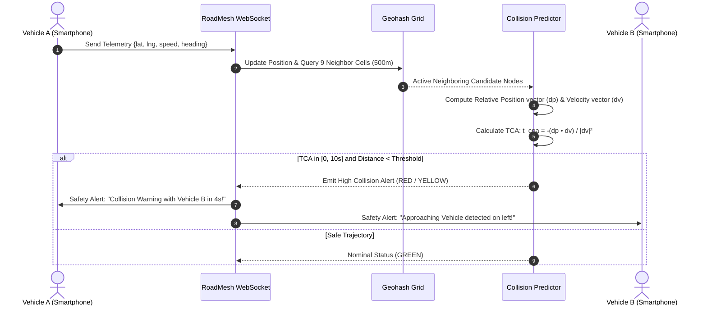

# 🚗 RoadMesh — Cooperative Vehicle Awareness & V2X Platform

[](https://github.com/mizhab-as/RoadMesh/actions)
[](https://github.com/mizhab-as/RoadMesh/actions)
[](LICENSE)
[](https://flutter.dev)
[](https://nodejs.org)
[](https://www.typescriptlang.org)
[](https://www.docker.com)

**RoadMesh** is a real-time, **zero-hardware, 100% smartphone-based** Cooperative Vehicle Awareness and Collision Warning Platform designed specifically for high-density, mixed-traffic environments (cars, two-wheelers, auto-rickshaws, commercial trucks, and transit buses).

Vehicles continuously broadcast high-frequency GPS, heading, and speed telemetry over ultra-low-latency WebSockets. The backend spatial AI engine performs sub-millisecond Geohash lookups across neighboring cells and projects dynamic Time-to-Closest-Approach (TCA) trajectories up to 10 seconds ahead—alerting drivers via directional visual HUD indicators, haptic feedback, and voice warnings.

> **💡 The Zero-Hardware Paradigm**: Traditional automotive V2X systems demand expensive OEM hardware ($600–$1,000+ / ₹50,000+ per vehicle) and dedicated roadside units (RSUs). RoadMesh democratizes vehicular safety by transforming everyday smartphones into intelligent connected nodes with zero hardware installations.

---

## 📸 Visual Showcase

### 1. Tactical Geospatial Operations Console (Web)
High-contrast operations dashboard rendering real-time vehicle telemetry vectors, 500m active spatial radar, dynamic camera framing, and live collision risk feeds.

<p align="center">
  
</p>

### 2. Mobile Cockpit & Free Driving HUD (Flutter App)
Photorealistic 3D map navigation with metallic sedan rendering, real-time speed readout (`km/h`), lane guidance, peer detection, and 3D perspective controls.

<p align="center">
  
  &nbsp;&nbsp;&nbsp;&nbsp;
  
</p>

---

## 🌟 Key Capabilities

- **📱 Pure Smartphone V2X (Zero Hardware)**: No aftermarket dongles, OBD units, or microcontrollers needed. Runs directly on drivers' Android and iOS smartphones.
- **⚡ Sub-50ms Telemetry Pipeline**: Lightweight binary/JSON telemetry payloads streamed over bidirectional WebSockets.
- **🧠 Geohash Precision-6 Spatial Indexing**: Sub-millisecond $O(1)$ grid queries evaluating 9 neighboring spatial buckets without $O(N^2)$ distance computation bottlenecks.
- **🎯 Predictive Collision AI (TCA)**: Relative velocity dot-product trajectory projection calculating Time-to-Closest-Approach (TCA) up to 10 seconds ahead.
- **🏎️ Clean Speedometer HUD**: Dedicated floating circular HUD showing the vehicle's actual GPS driving speed in `km/h` without arbitrary road speed limits or false alarms.
- **🛣️ 3D Tactical Navigation**: Google Maps vector map layer with 3D buildings, turn-by-turn guidance, lane indicators, and camera lock modes.
- **🛡️ Directional Multi-Sensory Alerts**: Real-time visual radar ripples, Text-to-Speech (TTS) voice callouts, and tactile haptic vibration warnings.
- **📊 Central Operations Console**: Web-based Leaflet map tracking fleet nodes, speeds, headings, and active perimeter collision risks.
- **🐳 One-Command Master Suite**: `./master.sh --all` automatically verifies the toolchain, builds and launches the server, establishes ADB reverse tunnels, installs the app, and opens the dashboard.

---

## 🏗️ System Architecture

```mermaid
graph TB
    subgraph Clients["📱 Smartphone Telemetry Nodes (Flutter)"]
        M1["Vehicle Node A\n(High-Accuracy GPS + Heading)"]
        M2["Vehicle Node B\n(High-Accuracy GPS + Heading)"]
        M3["Vehicle Node C\n(Two-Wheeler / Auto-Rickshaw)"]
    end

    subgraph Server["🖥️ RoadMesh Core Engine (Node 20 / TypeScript)"]
        direction TB
        WS["WebSocket Server (/ws)\nBi-directional Event Loop"]
        VS["VehicleStore\nIn-Memory Thread-Safe Cache"]
        SG["Geohash Spatial Indexer\nPrecision-6 (9 Neighbor Cells)"]
        CP["TTC Collision Predictor\nRelative Velocity Vector Dot-Product"]
        REST["REST API & Metrics\n/health • /vehicles • /metrics"]
    end

    subgraph Console["📊 Operations Console"]
        DASH["Tactical Web Dashboard\nLeaflet.js + Live Stream Inspector"]
    end

    M1 -->|Telemetry Broadcast (JSON)| WS
    M2 -->|Telemetry Broadcast (JSON)| WS
    M3 -->|Telemetry Broadcast (JSON)| WS

    WS --> VS
    VS --> SG
    SG --> CP
    CP -->|Direct Collision Warning| WS
    WS -->|Safety Broadcast Alert| M1
    WS -->|Safety Broadcast Alert| M2

    WS -->|Real-Time Telemetry Stream| DASH
    REST --> DASH
```

### Telemetry & Collision Resolution Algorithm



---

## 🚀 Getting Started

### Prerequisites
- **Node.js**: >= 20.0.0
- **npm**: >= 10.0.0
- **Flutter SDK**: >= 3.24.0
- **Android SDK / ADB**: Platform tools (for physical phone testing)

---

### Method 1: Master Orchestrator (Recommended)

Run the all-in-one script to compile the backend, launch the server, configure ADB port forwarding, install/update the app on your phone, and open the dashboard:

```bash
./master.sh --all
```

#### CLI Management Commands:

| Command | Action |
|---|---|
| `./master.sh --all` | Starts server, establishes USB tunnel, installs/launches app on phone, opens dashboard |
| `./master.sh --server` | Starts RoadMesh server on port 3000 & opens tactical dashboard |
| `./master.sh --mobile` | Connects phone, sets up reverse tunnel, installs app & auto-grants permissions |
| `./master.sh --cloud <url>` | Compiles mobile APK pre-configured for live cloud WebSocket |
| `./master.sh --status` | Live diagnostics of server PID, connected device, tunnels, and active nodes |
| `./master.sh --stop` | Cleanly terminates all background processes and frees port 3000 |

---

### Method 2: Manual Development Setup

#### 1. Start the Core Backend Server
```bash
cd roadmesh-server
npm install
npm test          # Run 61 automated unit & integration tests
npm run build     # Compile TypeScript and bundle dashboard
npm start         # Starts server on port 3000
```

- **Dashboard**: [http://localhost:3000/dashboard/](http://localhost:3000/dashboard/)
- **WebSocket Endpoint**: `ws://localhost:3000/ws`
- **Health Check**: [http://localhost:3000/health](http://localhost:3000/health)

#### 2. Run the Flutter Mobile App
```bash
cd roadmesh-app
flutter pub get
flutter analyze   # Verify 0 issues

# Forward port 3000 over USB cable to phone
adb reverse tcp:3000 tcp:3000

# Launch on connected device
flutter run
```

---

### Method 3: Containerized Deployment (Docker)

```bash
docker-compose up -d --build
```

- **Tactical Operations Dashboard**: `http://localhost/dashboard`
- **WebSocket Gateway**: `ws://localhost/ws`

---

## 📲 Samsung Galaxy (One UI) Installation Notes

If installing to a modern Samsung Galaxy device running One UI 6 / Android 14–16, Samsung's **Auto Blocker** security feature may silently block USB/ADB package installations:

1. **Turn OFF Auto Blocker**:
   - Open phone **Settings** ➔ **Security and privacy** ➔ **Auto Blocker** ➔ Toggle **OFF**.
2. **Enable USB Install**:
   - Open **Settings** ➔ **Developer options** ➔ Enable **Install via USB**.
3. **Screen Unlock**:
   - Keep the phone unlocked during install and tap **"Install anyway"** if Google Play Protect prompts.

---

## 📦 Production Release APK

A production-optimized release APK is compiled and staged in [`releases/`](releases/):

- **Binary**: [`releases/roadmesh-v1.0.0.apk`](releases/roadmesh-v1.0.0.apk)
- **Size**: ~24.0 MB (tree-shaken release build)
- **Checksum**: [`releases/roadmesh-v1.0.0.apk.sha256`](releases/roadmesh-v1.0.0.apk.sha256)

### Sideload to Phone via ADB:
```bash
adb install -r -d releases/roadmesh-v1.0.0.apk
adb shell am start -n com.example.roadmesh_app/.MainActivity
```

---

## 📡 WebSocket API Specification

### Telemetry Packet (`client -> server`)
Transmitted every 100–250ms by active vehicles:
```json
{
  "type": "telemetry",
  "data": {
    "id": "veh_alpha_921",
    "type": "car",
    "latitude": 10.05382,
    "longitude": 76.61931,
    "speed": 45.2,
    "heading": 84.5,
    "timestamp": 1788838719000
  }
}
```

### Safety Alert Packet (`server -> client`)
Pushed in real time when TCA indicates an imminent collision:
```json
{
  "type": "collision_alert",
  "data": {
    "targetVehicleId": "veh_bravo_404",
    "threatLevel": "CRITICAL",
    "timeToCollision": 3.8,
    "relativeDistance": 18.4,
    "bearing": 92.0,
    "suggestedAction": "HARD_BRAKE"
  }
}
```

---

## 🧪 Testing & Quality Verification

```bash
# Backend test suite (Vitest)
cd roadmesh-server && npm test
# 61 passed across 5 test suites (geo, geohash, predictor, store, server)

# Flutter static analysis
cd roadmesh-app && flutter analyze
# 0 issues found!
```

---

## 📄 License

This project is licensed under the MIT License — see the [LICENSE](LICENSE) file for details.
