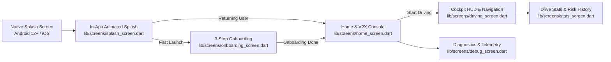

# 🚗 RoadMesh Mobile Client (`roadmesh-app`)

[](https://flutter.dev)
[](https://dart.dev)
[]()
[]()

High-performance, real-time Flutter client for **RoadMesh** — the zero-hardware, 100% smartphone-based Cooperative Vehicle Awareness (V2X) and Collision Warning platform.

---

## 🎨 Brand Identity & Asset Pipeline

The app features a custom automotive daylight aesthetic with a dynamic radar mesh beacon, vector typography, and multi-platform native asset generation:

```
roadmesh-app/assets/
├── icons/
│   ├── app-icon.png / .svg                 # 1024×1024 master icon (iOS & Web)
│   ├── adaptive-icon-background.png / .svg  # 432×432 Android adaptive background
│   └── adaptive-icon-foreground.png / .svg  # 432×432 Android adaptive foreground mark
├── splash/
│   ├── splash-icon.png / .svg               # 512×512 centered mark for native splash
│   └── splash-preview.png / .svg            # Mockup preview
├── logo/
│   ├── logo-horizontal-light-bg.png / .svg  # Primary daylight UI header lockup
│   ├── logo-horizontal-dark-bg.png / .svg   # Dark-mode map / tactical lockup
│   └── logo-mark-standalone.png / .svg      # Standalone radar beacon mark
└── fonts/
    ├── Inter-*.ttf                          # Clean, high-readability sans-serif
    └── Orbitron-*.ttf                       # Digital HUD & telemetry typography
```

### Color Palette & Visual Semantics

| Token | Hex | Role |
|---|---|---|
| `meshGreen` | `#22C55E` | Connected peer vehicles, active route line, "Start Driving" |
| `vehicleBlue` | `#2563EB` | Ego-vehicle beacon & primary automotive accent |
| `alertRed` | `#EF4444` | Real-time collision radar pulse & critical warning halo |
| `warningAmber` | `#F59E0B` | Proximity caution & moderate risk alerts |
| `mapBackground` | `#E7ECF2` | Clean daylight vector map canvas |
| `darkSurface` | `#0F172A` | Deep obsidian night-mode HUD & tactical cards |

---

## 🚀 App Architecture & Screen Flow



1. **Native Splash (`flutter_native_splash`)**: System-level startup screen for Android and iOS matching light/dark OS themes.
2. **In-App Splash (`SplashScreen`)**: 60/120fps vector canvas rendering a live collision-radar pulse around the blue ego-beacon with official `ROADMESH` typography.
3. **Onboarding (`OnboardingScreen`)**: 3-step carousel introducing V2X, the real-time AI collision predictor, and anonymous zero-storage privacy.
4. **Home Console (`HomeScreen`)**: Beacon radar orb, WebSocket server selector with one-tap presets (Local, ADB, Cloud), and vehicle type picker.
5. **Driving HUD (`DrivingScreen`)**: 3D vector map, speed gauge (`km/h`), dynamic lane guidance, heading compass, and multi-sensory collision alerts (visual halo, vibration cadences, TTS voice callouts).
6. **Analytics (`StatsScreen`)**: Post-drive diagnostics, near-miss graphs (`fl_chart`), and telemetry latency logs.

---

## 🛠️ Developer Setup & Commands

### 1. Install Dependencies
```bash
flutter pub get
```

### 2. Regenerate App Icons & Native Splash
When updating brand assets in `assets/icons/` or `assets/splash/`:

```bash
# Generate Android (adaptive + legacy) and iOS launcher icons
dart run flutter_launcher_icons

# Generate Android 12+ and iOS native splash screens
dart run flutter_native_splash:create
```

### 3. Run the App
```bash
# Forward WebSocket port over USB ADB tunnel (if running local backend)
adb reverse tcp:3000 tcp:3000

# Launch on connected device
flutter run
```

### 4. Build Release APK
```bash
flutter build apk --release --target-platform android-arm64
```

### 5. Quality Assurance
```bash
flutter analyze
flutter test
```
